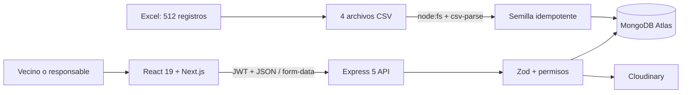
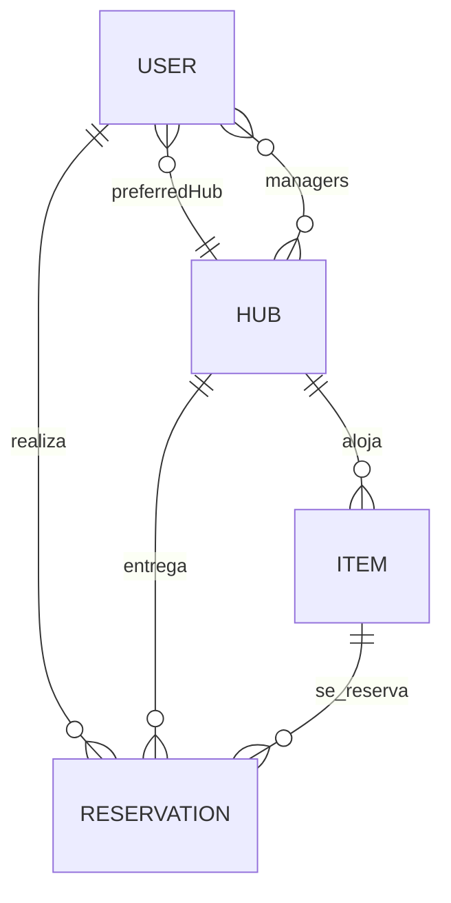

# Arquitectura de ReNodo

## Flujo principal

## Fronteras

- `apps/web`: experiencia pública, autenticación, catálogo, reserva, cuenta y gestión.
- `apps/api`: reglas de negocio, autorización, persistencia, ficheros y documentación REST.
- `data`: fuente inicial auditable y manifiesto de integridad.

## Colecciones y relaciones

Las reservas utilizan intervalos semiabiertos `[startDate, endDate)`. Por ello una devolución
el lunes y una nueva recogida el mismo lunes no se consideran solapadas. La API incrementa
`Item.bookingVersion` dentro de una transacción para serializar reservas concurrentes del
mismo objeto.

## Capas del backend

1. **Rutas:** definen método, middleware y contrato.
2. **Validadores:** Zod normaliza body, params y query.
3. **Controladores:** traducen HTTP a casos de uso.
4. **Servicios:** autorización, reservas y Cloudinary.
5. **Modelos:** esquemas, índices y restricciones de MongoDB.
6. **Errores:** respuesta uniforme con código, mensaje y detalles seguros.

## Estado del frontend

- TanStack Query gestiona caché, reintentos y estados de carga.
- `useReducer` modela filtros y la cola de operaciones.
- `useDeferredValue` mantiene la búsqueda fluida.
- `useTransition` marca actualizaciones de baja prioridad.
- `useOptimistic` adelanta la cancelación de una reserva.
- Context + reducer conserva la sesión y separa usuario, token y modo demo.
- Un hook propio guarda favoritos únicos en `localStorage`.

## Seguridad

- JWT Bearer y contraseñas cifradas con bcrypt.
- El registro ignora cualquier rol recibido y crea siempre `member`.
- El usuario autenticado se recarga en cada petición protegida.
- Managers limitados a los centros asignados; admin coordina toda la red.
- Helmet, CORS por allowlist, compresión, rate limiting y límite de payload.
- Multer en memoria: JPG, PNG o WebP hasta 5 MB.
- Al sustituir o eliminar una imagen se limpia el recurso anterior de Cloudinary.
- Los borrados de entidades con historial son lógicos.
